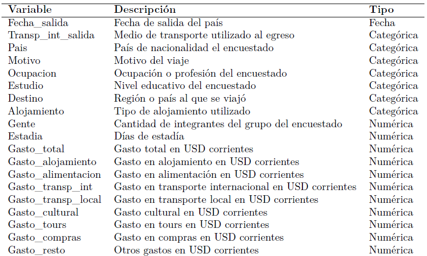

```{r setup, include=FALSE}
knitr::opts_chunk$set(echo = TRUE, tidy.opts = list(width.cutoff = 50), tidy = TRUE, fig.pos = 'H', out.extra = '',warning = FALSE,message = FALSE)
```

```{r,echo = FALSE,include = FALSE}

# Cargamos librerías
library(tidyverse)
library(readxl)
library(lubridate)
library(forcats)
library(ggplot2)
library(here)
library(patchwork)
emisivo <- read_excel(here("Datos","emisivo.xlsx"))
datos <- emisivo %>% 
  select("Transporte Internacional de Salida", 
         "FechaSalida","Pais","Motivo","IdOcupacion","Ocupacion",
         "Estudio","Destino","Alojamiento","Gente",
         "Estadia","GastoTotal","GastoAlojamiento",
         "GastoAlimentacion","GastoTransporteInternac",
         "GatoTransporteLocal","GastoCultural","GastoTours",
         "GastoCompras","GastoResto")
names(datos) <- c("Transp_int_salida","Fecha_salida","Pais",
                  "Motivo","IdOcupacion","Ocupacion","Estudio","Destino",
                  "Alojamiento","Gente","Estadia","Gasto_total",
                  "Gasto_alojamiento","Gasto_alimentacion","Gasto_transp_int",
                  "Gasto_transp_local","Gasto_cultural","Gasto_tours",
                  "Gasto_compras","Gasto_resto")
# Filtramos a los turistas de Uruguay
datos <- datos %>% 
  filter(Pais=="Uruguay")
```
## <span style="color:#5ab4ac">Introducción</span>

- Se trabajó con la última base de turismo emisivo, publicada por el Ministerio de Turismo. 
- Comprende información acerca del turismo en el exterior entre diciembre de 2016 y marzo de 2020.

- La base de datos original consta de 16.295 observaciones y 41 variables numéricas, categóricas y de identificación.

- Dado que se trata de una encuesta, dos de esas variables corresponden a juegos de ponderadores. Aunque en este trabajo se optó por no expandir la muestra, es importante tener en cuenta que esto puede introducir sesgos en las estimaciones.

## <span style="color:#5ab4ac">Objetivos</span>

- Analizar al gasto por día y por persona de los turistas uruguayos en el exterior. En particular, se estudió su evolución entre enero de 2017 y marzo de 2020, desagregado por distintos rubros.

- Indagar sobre la existencia de posibles asociaciones entre el gasto y diferentes variables categóricas como, por ejemplo, el destino y el motivo del viaje.


## <span style="color:#5ab4ac">Variables</span>

{width=90%}

## <span style="color:#5ab4ac">Selección de observaciones</span>

- Se filtró a los turistas que, si bien salieron de Uruguay, no tienen nacionalidad uruguaya.

- Para facilitar la visualización, se eliminó un *outlier*, cuyo gasto total era extremadamente alto.

- No se eliminaron los individuos que reportaron gastos nulos ya que, en su mayoría, son personas que fueron a visitar familiares y/o amigos y se alojaron con ellos, por lo que no debieron incurrir en gastos.

## <span style="color:#5ab4ac">Observaciones atípicas</span>
```{r boxplot_gasto, fig.height=2,fig.width=5, echo=FALSE, fig.align='center',fig.pos = 'H'}

datos %>% 
  ggplot() +
  geom_boxplot(aes(x=Gasto_total)) +
  labs(x="Gasto total (en USD corrientes)") +
  theme(axis.text.y = element_blank(),
        axis.ticks.y = element_blank())

```

```{r, echo=FALSE, results='hide'}

# Analizamos el dato atípico
datos %>% 
  filter(Gasto_total>70000) %>% 
  select(Gasto_total,Estadia,Gente,Destino) %>% 
  mutate(gasto_diario_persona=Gasto_total/(Estadia*Gente))

```

```{r, echo=FALSE, results='hide'}

# Eliminamos el punto más extremo
datos <- datos %>% 
  filter(Gasto_total<30000)

```

```{r, echo=FALSE, results='hide'}

# Volvemos a hacer el gráfico de caja (seguimos teniendo muchos datos atípicos)
boxplot_sin_outliers <- datos %>% 
  ggplot() +
  geom_boxplot(aes(x=Gasto_total)) +
  labs(x="Gasto total (en USD corrientes)") +
  theme(axis.text.y = element_blank(),
        axis.ticks.y = element_blank())
# Hacemos el histograma
histograma <- datos %>% 
  ggplot( mapping = aes(x = Gasto_total)) +
  geom_histogram(bins = 30, col = "black", position = 'identity', fill="#a6bddb")  +
  labs(x="Gasto total (en USD corrientes)", y="Frecuencia de turistas")

```

```{r sin_outliers, echo=FALSE,fig.height=2,fig.width=5, fig.align='center',fig.pos = 'H'}

boxplot_sin_outliers+histograma

```

## <span style="color:#5ab4ac">Gastos nulos</span>
Gasto nulo según tipo de alojamiento

```{r gasto_nulo_alojamiento, echo = FALSE, fig.height=2,fig.width=6, fig.align='center',fig.pos = 'H'}

# Analizamos las observaciones con gasto nulo
#summary(datos$Gasto_total)
datos %>% 
  filter(Gasto_total==0) %>% 
  mutate(Alojamiento_rec=case_when(Alojamiento %in% c("Appart Hotel",
                                                      "Hotel",
                                                      "Hostel") ~ "Hotel/Hostel",
                                   Alojamiento == c("Cabañas, Bungalows",
                                                    "Vivienda Arrendada") ~ "Alquiler",
                                   Alojamiento == "Vivienda Propia" ~ "Vivienda propia",
                                   Alojamiento == "Camping" ~ "Camping",
                                   Alojamiento == "Barco, Yate, Crucero" ~ "Yate/Crucero",
                                   Alojamiento == "Vivienda Familiares / Amigos" ~ "Familiares/Amigos",
                                   TRUE ~ "Otros")) %>%
  ggplot() + 
  geom_bar(aes(x=fct_infreq(Alojamiento_rec)),fill="#a6bddb",col="black") +
  labs(x="Tipo de alojamiento",
       y="Frecuencia absoluta")

```
Gasto nulo según motivo de viaje

```{r gasto_nulo_motivo,echo=FALSE,fig.height=2,fig.width=6, fig.align='center',fig.pos = 'H'}

datos %>% 
  filter(Gasto_total==0) %>% 
  mutate(Motivo_rec=case_when(Motivo == "Compras" ~ "Compras",
                              Motivo == "Deportivo" ~ "Deportes",
                              Motivo == "Estudios" ~ "Estudios",
                              Motivo %in% c("Negocios, Profesion",
                                            "Trabajo remunerado Destino") ~ "Trabajo",
                              Motivo == "Ocio, Recreo, Vacaciones" ~ "Vacaciones",
                              Motivo == "Visita familiares / amigos" ~ "Visita",
                              TRUE ~ "Salud")) %>%
  ggplot() +
  geom_bar(aes(x=fct_infreq(Motivo_rec)),fill="#a6bddb",col="black") +
  labs(x="Motivo del viaje",
       y="Frecuencia absoluta")

```

## <span style="color:#5ab4ac">Consideraciones adicionales</span>

- La variable *Gasto\_total* registra el gasto realizado por todo el grupo de viaje del encuestado durante toda su estadía en el exterior. Para generar resultados comparables entre encuestados, *gasto\_persona\_diario*, que para cada observación mide el gasto medio diario y pér cápita.

- Los gastos originales se encuentran expresados en dólares americanos corrientes. Sin embargo, también se expresaron en términos reales deflactando cada serie por el Índice de Precios al Consumo para Consumidores Urbanos de Estados Unidos.

- Para facilitar la visualización de posibles cambios en los patrones de gasto se extrajo su tendencia. Es decir, se filtró la estacionalidad y el componente irregular de la serie.

## <span style="color:#5ab4ac">Gasto total</span>

```{r gasto_personas,echo = FALSE,results = "hide",fig.height=2.5,fig.width=6,fig.align='center',fig.pos = 'H'}

# Analizamos el gasto total en función de la cantidad de integrantes por grupo
quantile(datos$Gente,probs = c(0.25,0.5,0.75,1))
datos %>% 
  mutate(tramos_personas=cut(Gente,breaks=c(0,2,4,6,8,15))) %>% 
  ggplot() +
  geom_boxplot(aes(x=reorder(tramos_personas,Gasto_total),
                   y=Gasto_total,
                   fill=tramos_personas)) +
  theme(legend.position ="none") +
  labs(x="Cantidad de integrantes por grupo",
       y="Gasto total (en USD corrientes)")

```
```{r gasto_estadia,echo = FALSE,results = "hide",fig.height=2.5,fig.width=6,fig.align='center',fig.pos = 'H'}

# Analizamos el gasto total en función de los días de estadía
quantile(datos$Estadia,probs = c(0.25,0.5,0.75,1))
datos %>% 
  mutate(tramos_estadia=cut(Estadia,
                             breaks=c(0,quantile(datos$Estadia,probs = c(0.25,0.5,0.75,1))))) %>% 
  ggplot() +
  geom_boxplot(aes(x=reorder(tramos_estadia,Gasto_total),
                   y=Gasto_total,
                   fill=tramos_estadia)) +
  theme(legend.position ="none") +
  labs(x="Cantidad de días",
       y="Gasto total (en USD corrientes)")

```

## <span style="color:#5ab4ac">Evolución de la cantidad de salidas</span>

```{r evolucion, echo = FALSE, fig.height=4, fig.width=6,fig.align='center',fig.pos = 'H'}

# Nos interesa trabajar con datos desde 2017
datos <- datos %>% 
  filter(year(Fecha_salida)!=2016)

# Evolución del turismo emisivo entre enero de 2017 y marzo de 2020
datos %>% 
  count(salida_anio_mes=round_date(Fecha_salida,"month")) %>% 
  ggplot()+
  geom_line(aes(x=salida_anio_mes,y=n)) +
  labs(x="Fecha de salida",
       y="Cantidad de salidas")

```

## <span style="color:#5ab4ac">Evolución del gasto (USD corrientes)</span>
```{r evolucion_gasto,echo = FALSE, fig.height=2.5, fig.width=6,fig.align='center',results='hide',fig.pos = 'H'}

# Trabajamos con el gasto diario por persona
datos <- datos %>% 
  mutate(gasto_persona_diario=Gasto_total/(Estadia*Gente),
         alojamiento_persona_diario=Gasto_alojamiento/(Estadia*Gente),
         alimentacion_persona_diario=Gasto_alimentacion/(Estadia*Gente),
         transint_persona_diario=Gasto_transp_int/(Estadia*Gente),
         transloc_persona_diario=Gasto_transp_local/(Estadia*Gente),
         cultural_persona_diario=Gasto_cultural/(Estadia*Gente),
         tours_persona_diario=Gasto_tours/(Estadia*Gente),
         compras_persona_diario=Gasto_compras/(Estadia*Gente),
         resto_persona_diario=Gasto_resto/(Estadia*Gente))

# Graficamos la evolución del gasto medio por concepto por persona y por día
datos %>% 
  mutate(salida_anio_mes=round_date(Fecha_salida,"month")) %>% 
  group_by(salida_anio_mes) %>% 
  summarise("Alojamiento"=mean(alojamiento_persona_diario),
            "Alimentacion"=mean(alimentacion_persona_diario),
            "Transporte internacional"=mean(transint_persona_diario),
            "Transporte local"=mean(transloc_persona_diario),
            "Cultural"=mean(cultural_persona_diario),
            "Tours"=mean(tours_persona_diario),
            "Compras"=mean(compras_persona_diario),
            "Resto"=mean(resto_persona_diario)) %>% 
  pivot_longer(cols = Alojamiento:Resto,
               names_to = "tipo",values_to = "gasto_medio") %>% 
  ggplot() +
  geom_line(aes(x=salida_anio_mes,y=gasto_medio,color=tipo)) +
  labs(x="Fecha de salida",
       y="Gasto diario por persona",
       color="Concepto")


```

```{r, echo=FALSE}

# Extraemos la tendencia de las series
desest <- datos %>% 
  mutate(salida_anio_mes=round_date(Fecha_salida,"month")) %>% 
  group_by(salida_anio_mes) %>% 
  summarise("Alojamiento"=mean(alojamiento_persona_diario),
            "Alimentacion"=mean(alimentacion_persona_diario),
            "Transporte internacional"=mean(transint_persona_diario),
            "Transporte local"=mean(transloc_persona_diario),
            "Cultural"=mean(cultural_persona_diario),
            "Tours"=mean(tours_persona_diario),
            "Compras"=mean(compras_persona_diario),
            "Resto"=mean(resto_persona_diario)) %>% 
  arrange(salida_anio_mes)
alojamiento <- ts(desest$Alojamiento,start=c(2017,1),end = c(2020,3),frequency = 12)
alojamiento <- alojamiento %>% 
  stl("periodic")
alojamiento <- as.data.frame(alojamiento$time.series)
alojamiento <- alojamiento %>% 
  select(trend) %>% 
  rename("alojamiento_tend"="trend")
alimentacion <- ts(desest$Alimentacion,start=c(2017,1),end = c(2020,3),frequency = 12)
alimentacion <- alimentacion %>% 
  stl("periodic")
alimentacion <- as.data.frame(alimentacion$time.series)
alimentacion <- alimentacion %>% 
  select(trend) %>% 
  rename("alimentacion_tend"="trend")
trans_int <- ts(desest$`Transporte internacional`,start=c(2017,1),end = c(2020,3),frequency = 12)
trans_int <- trans_int %>% 
  stl("periodic")
trans_int <- as.data.frame(trans_int$time.series)
trans_int <- trans_int %>% 
  select(trend) %>% 
  rename("trans_int_tend"="trend")
trans_loc <- ts(desest$`Transporte local`,start=c(2017,1),end = c(2020,3),frequency = 12)
trans_loc <- trans_loc %>% 
  stl("periodic")
trans_loc <- as.data.frame(trans_loc$time.series)
trans_loc <- trans_loc %>% 
  select(trend) %>% 
  rename("trans_loc_tend"="trend")
cultural <- ts(desest$Cultural,start=c(2017,1),end = c(2020,3),frequency = 12)
cultural <- cultural %>% 
  stl("periodic")
cultural <- as.data.frame(cultural$time.series)
cultural <- cultural %>% 
  select(trend) %>% 
  rename("cultural_tend"="trend")
tours <- ts(desest$Tours,start=c(2017,1),end = c(2020,3),frequency = 12)
tours <- tours %>% 
  stl("periodic")
tours <- as.data.frame(tours$time.series)
tours <- tours %>% 
  select(trend) %>% 
  rename("tours_tend"="trend")
compras <- ts(desest$Compras,start=c(2017,1),end = c(2020,3),frequency = 12)
compras <- compras %>% 
  stl("periodic")
compras <- as.data.frame(compras$time.series)
compras <- compras %>% 
  select(trend) %>% 
  rename("compras_tend"="trend")
resto <- ts(desest$Resto,start=c(2017,1),end = c(2020,3),frequency = 12)
resto <- resto %>% 
  stl("periodic")
resto <- as.data.frame(resto$time.series)
resto <- resto %>% 
  select(trend) %>% 
  rename("resto_tend"="trend")
desest <- cbind(desest,alojamiento,alimentacion,trans_int,trans_loc,cultural,tours,compras,resto)

```

```{r evolucion_desest,echo = FALSE,message=FALSE,warning=FALSE,fig.height=2.5,fig.width=6,fig.align='center',fig.pos = 'H'}

# Graficamos las series con las tendencias
desest %>%
  pivot_longer(cols = alojamiento_tend:resto_tend,
               names_to = "tipo",values_to = "gasto_tend") %>% 
  mutate(tipo=recode(tipo,"alimentacion_tend"="Alimentación",
                     "alojamiento_tend"="Alojamiento",
                     "compras_tend"="Compras",
                     "cultural_tend"="Cultural",
                     "resto_tend"="Resto",
                     "tours_tend"="Tours",
                     "trans_int_tend"="Transporte internacional",
                     "trans_loc_tend"="Transporte local")) %>% 
  ggplot() +
  geom_line(aes(x=salida_anio_mes,y=gasto_tend,color=tipo)) +
  labs(x="Fecha de salida",
       y="Tendencia del gasto diario por persona",
       color="Concepto")
```

## <span style="color:#5ab4ac">Distribución del gasto (USD corrientes)</span>
Distribución del gasto por destino
```{r boxplot1,echo = FALSE,message=FALSE,warning=FALSE,fig.height=2.5,fig.width=6,fig.align='center',fig.pos = 'H'}

datos %>%
  mutate(Destino_rec=case_when(Destino %in% c("Argentina","Brasil", "Chile", "Paraguay", "Resto Sud America") ~ "Sudamérica",
                           Destino == "Africa" ~ "África",
                           Destino %in% c("Asia del Este y Pacifico","Asia Meridional","Oriente Medio") ~ "Asia",
                           Destino == "Centro y Norte America" ~ "Norte y \n Centroamérica",
                           Destino %in% c("Otros","Sin Datos") ~ "Otros/ \n Sin datos",
                           Destino == "Europa" ~ "Europa")) %>%
  filter(gasto_persona_diario < 4000) %>%  
  ggplot() +
  geom_boxplot(aes(x=reorder(Destino_rec,gasto_persona_diario),
                   y=gasto_persona_diario,
                   fill=Destino_rec)) +
  labs(x="Destino",  y="Gasto diario por persona") +
  theme(legend.position = "none")

```
Distribución del gasto por nivel educativo
```{r boxplot2, echo=FALSE,message=FALSE,warning=FALSE,fig.height=2.5,fig.width=6,fig.align='center',fig.pos = 'H'}

datos %>%
  mutate(Estudio_rec=case_when(Estudio == "Primaria incompleta" ~ "Sin primaria",
                               Estudio %in% c("Primaria completa",  "Secundaria incompleta") ~ "Primaria",
                               Estudio %in% c("Secundaria completa", "Terciaria incompleta") ~ "Secundaria",
                               Estudio == "Terciaria completa" ~ "Terciaria",
                               TRUE ~ "Otros/Sin datos")) %>% 
     filter(gasto_persona_diario < 4000) %>%  
  ggplot() +
  geom_boxplot(aes(x=reorder(Estudio_rec,gasto_persona_diario),
                   y=gasto_persona_diario,
                   fill=Estudio_rec)) +
  labs(x="Nivel educativo máximo",y="Gasto diario por persona") +
  theme(legend.position = "none")

```

## <span style="color:#5ab4ac">Distribución del gasto (USD corrientes)</span>
Distribución del gasto por ocupación
```{r boxplot3, echo=FALSE,message=FALSE,warning=FALSE,fig.height=2.5,fig.width=6,fig.align='center',fig.pos = 'H'}

datos %>%
  mutate(Ocupacion_rec=case_when(IdOcupacion %in% 1:5 ~ "Inactivo",
                                 IdOcupacion==8 ~ "Desocupado",
                                 IdOcupacion %in% 11:21 ~ "Ocupado",
                                 IdOcupacion %in%  c(0,9) | c(22,99)    ~ "Otros/Sin datos")) %>% 
     filter(gasto_persona_diario  <4000) %>% 
  ggplot() +
  geom_boxplot(aes(x=reorder(Ocupacion_rec,gasto_persona_diario), y=gasto_persona_diario,
                   fill=Ocupacion_rec)) +
  labs(x="Ocupación",  y="Gasto diario por persona") +
  theme(legend.position = "none")

```
Distribución del gasto por tipo de alojamiento
```{r boxplot5, echo=FALSE,message=FALSE,warning=FALSE,fig.height=2.5,fig.width=6,fig.align='center',fig.pos = 'H'}

datos %>% 
  mutate(Alojamiento_rec=case_when(Alojamiento %in% c("Appart Hotel","Hotel", "Hostel") ~ "Hotel/Hostel",
                                   Alojamiento == c("Cabañas, Bungalows", "Vivienda Arrendada") ~ "Alquiler",
                                   Alojamiento == "Vivienda Propia" ~ "Vivienda \n propia",
                                   Alojamiento == "Camping" ~ "Camping",
                                   Alojamiento == "Barco, Yate, Crucero" ~ "Yate/ \n Crucero",
                                   Alojamiento == "Vivienda Familiares / Amigos" ~ "Familiares/ \n Amigos",
                                   TRUE ~ "Otros")) %>%
     filter(gasto_persona_diario < 4000) %>% 
  ggplot() +
  geom_boxplot(aes(x=reorder(Alojamiento_rec,gasto_persona_diario),
                   y=gasto_persona_diario,
                   fill=Alojamiento_rec)) +
  labs(x="Tipo de alojamiento",     y="Gasto diario por persona") +
  theme(legend.position = "none")

```

## <span style="color:#5ab4ac">Conclusiones</span>

- En cuanto a la evolución de los gastos por rubros, se arribó a varios resultados interesantes:
  * El transporte internacional constituye el principal componente del gasto de los turistas uruguayos en el exterior.
  * La caída en el transporte internacional coincide con un crecimiento en la cantidad de viajes a Argentina.
  * Los costos por concepto de alimentación, alojamiento, transporte local, actividades culturales tours exhiben una media aproximadamente constante a lo largo del tiempo.
  * El gasto en compras es, por lejos, el componente más volátil del gasto medio diario por persona.

## <span style="color:#5ab4ac">Conclusiones</span>

- Al analizar el gasto medio diario por persona en función de distintas variables categóricas, se concluye que:
  * La región de destino más costosa es Asia. Sin embargo, existen varios datos inusualmente altos entre quienes viajan a otras partes del mundo.
  * A mayor nivel educativo del encuestado, mayor tiende a ser el gasto total.
  * Los individuos ocupados tienden a gastar más que los desempleados y los inactivos.
  * Quienes viajan para visitar a familiares tienden a gastar menos. Esto se debe a que, con frecuencia, se evitan los costos de alojamiento.

- Los principales resultados del trabajo se resumen en la [Shiny](https://patriciamartell.shinyapps.io/ShinyApp/).

